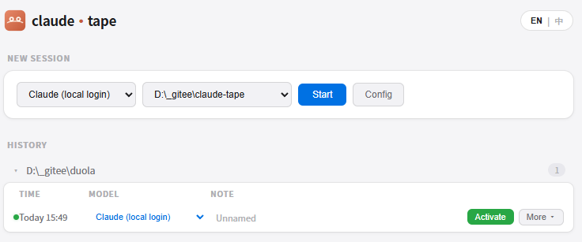
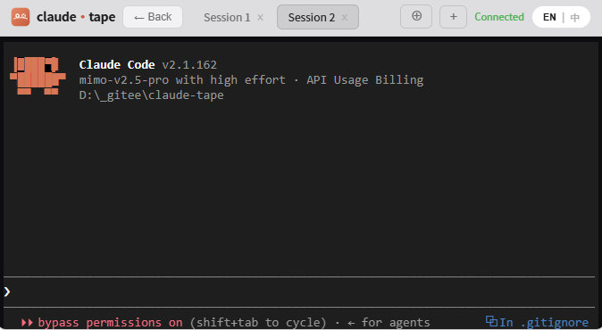
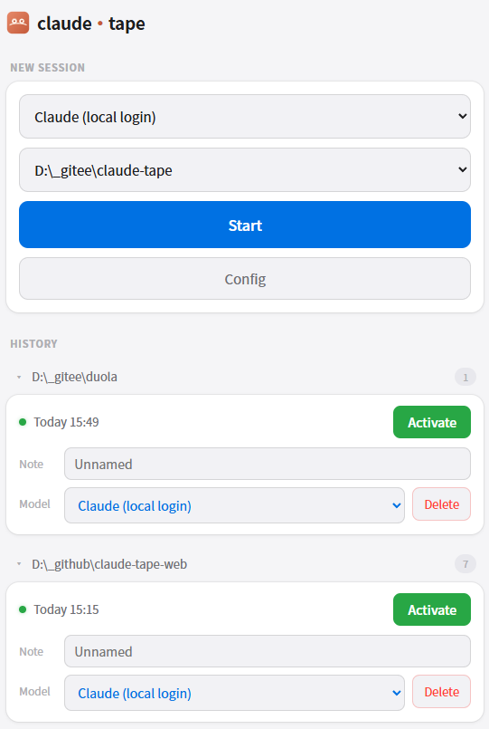

<p align="center">
  <h1 align="center">Claude Tape Web</h1>
</p>

<p align="center">
  <a href="./README.md">English</a>
  &nbsp;·&nbsp;
  <strong>简体中文</strong>
</p>

<p align="center">
  <a href="https://github.com/dongyongwei/claude-tape-web/stargazers"></a>
  <a href="https://github.com/dongyongwei/claude-tape-web/network/members"></a>
  <a href="./LICENSE"></a>
  <a href="https://github.com/dongyongwei/claude-tape-web/issues"></a>
  <a href="https://github.com/dongyongwei/claude-tape-web/graphs/contributors"></a>
</p>

<br/>

<h3 align="center">Claude Code Web 终端</h3>
<p align="center">单进程集成 agent + WSS 服务 + 静态页，浏览器直连本机 Claude Code 终端。</p>

<br/>

## 核心功能

- **Web 终端**：基于 xterm.js 的浏览器终端，完整 PTY 交互
- **多会话**：同时运行多个 Claude Code 会话
- **多模型**：支持第三方 Anthropic 兼容端点（Kimi K2、智谱 GLM 等）
- **访问控制**：简易令牌门禁，防止未授权访问
- **会话持久化**：本地保存会话索引，支持历史查看
- **可视化配置**：页面内编辑配置，支持热加载
- **手机适配**：支持手机端访问，提供独立的移动端界面

## 项目亮点

### 会话索引持久化
- 会话信息自动保存在 `~/.agent_win_serve/sessions/` 目录
- 按项目工作目录分组，每个会话独立 JSON 文件
- 记录会话状态、模型信息、创建时间、最后活跃时间
- 支持会话列表查看、标签编辑、删除管理

### 会话激活与模型切换
- 支持重新激活历史会话，带着完整上下文继续对话
- 激活时可切换第三方模型，无需重新开始
- PTY 进程在后台持续运行，WebSocket 断开不影响会话
- 支持精确恢复（`--resume`）和继续最新对话（`--continue`）

### 第三方模型热加载
- 配置文件保存后立即生效，无需重启服务
- 支持运行时添加、修改、删除第三方模型配置
- 模型配置通过环境变量注入 PTY 进程，隔离安全
- 内置模型（Official Claude）与第三方模型并存，灵活切换

### 模型配置导入导出
- 支持将第三方模型配置导出为 JSON 文件，方便存档备份
- 支持从 JSON 文件导入模型配置，换电脑后一键恢复
- 导入导出功能在设置界面中直接操作，无需手动编辑配置文件

## 快速开始

### 安装依赖
```bash
pip install -r requirements.txt
```

### 启动服务
```bash
python __main__.py
```

首次启动会随机生成访问令牌，请妥善保存。启动后会显示多种访问模式：
- **本地访问**：http://127.0.0.1:8009
- **局域网访问**：http://<本机IP>:8009
- **外部访问**：http://0.0.0.0:8009（所有网络接口）

### 访问页面
输入访问令牌即可使用。

**PC Web 界面**：


**多页签操作**：


流畅的多页签体验——彻底告别一个页面只能有一个 Session 的尴尬。打开多个页签，同时处理不同任务。

**手机端访问**：在浏览器地址栏末尾添加 `/m`（如 `http://127.0.0.1:8009/m`），即可访问专为手机优化的移动端界面。

**H5 手机端界面**：


如需外网访问，参考下方 ngrok 配置。

## 打包为独立可执行文件

使用 Nuitka 打包为单文件 exe：

```powershell
.\.venv\Scripts\python.exe -m nuitka --standalone --onefile --output-dir=dist-nuitka --include-data-dir=static=static --assume-yes-for-downloads --windows-console-mode=force --output-filename=claude-tape-web.exe __main__.py
```

输出：`dist-nuitka\claude-tape-web.exe`

> **注意**：不建议使用 PyInstaller 打包。PyInstaller 的 bootloader 会将控制台控制信号（CTRL_C_EVENT）传播给通过 winpty 创建的子进程，导致 Claude CLI 立即退出（退出码 `0xC000013A`）。Nuitka 将 Python 编译为原生 C 代码，不存在此问题。

## 配置说明

### 配置文件位置
默认路径：`~/.agent_win_serve/config.json`
可通过环境变量 `SERVE_CONFIG` 指定其他路径。

### 配置方式
配置文件会在首次通过Web界面保存配置时自动创建，无需手动操作。启动后访问页面，在设置界面中配置即可。

### 主要配置字段
| 字段 | 说明 |
|---|---|
| claude_bin | claude 可执行文件路径，默认为空，初始化时自动查找本地 claude，未找到则使用 `C:/Users/{Your user}/.local/bin/claude.exe`（用户名为当前系统用户） |
| access_token | 访问令牌 |
| project_dirs | 工作目录候选，用 `;` 分隔 |
| models | 第三方模型配置数组 |

**说明**：
- `host` 和 `port` 字段为可选配置，默认值分别为 `0.0.0.0` 和 `8009`。启动时会自动显示多种访问模式（本地、局域网、外部）
- 支持 `claude login` 本地登录方式，无需强制使用 API Key

### 多模型配置示例
```json
{
  "models": [
    {
      "id": "1",
      "name": "Official Claude (local login)",
      "base_url": "",
      "auth_token": "",
      "model": ""
    },
    {
      "id": "2",
      "name": "Kimi K2",
      "base_url": "https://api.moonshot.cn/anthropic",
      "auth_token": "sk-your-key",
      "model": "kimi-k2-0905-preview"
    }
  ]
}
```

**说明**：
- `id` 字段为自增数字，用于标识模型配置
- 内置模型（Official Claude）使用本地登录方式，无需 API Key
- 第三方模型需要提供对应的 `auth_token`

## 环境变量

| 变量 | 默认值 | 说明 |
|---|---|---|
| SERVE_CONFIG | ~/.agent_win_serve/config.json | 配置文件路径 |
| CLAUDE_BIN | (空) | claude 可执行文件路径，为空时自动查找本地 claude，未找到则使用 `C:/Users/{Your user}/.local/bin/claude.exe` |
| PROJECT_DIRS | (空) | 工作目录候选 |
| ACCESS_TOKEN | (空) | 访问令牌 |

**说明**：
- `SERVE_HOST` 和 `SERVE_PORT` 环境变量为可选配置，默认值分别为 `0.0.0.0` 和 `8009`
- 支持 `claude login` 本地登录方式，无需强制使用 API Key

## 外网访问

使用 ngrok 将本地服务暴露到外网：

```bash
# 安装 ngrok（如果尚未安装）
# Windows: 下载 https://ngrok.com/download 或使用 scoop install ngrok

# 启动服务后，在另一个终端运行
ngrok http 8009
```

ngrok 会分配一个公网地址（如 `https://xxxx.ngrok-free.app`），通过该地址即可在外网访问服务。

**注意**：外网访问时，访问令牌（access_token）仍然有效，确保服务安全。

## 项目结构

```
claude-tape-web/
├── static/             # 前端静态文件
│   ├── index.html      # 主页面
│   ├── terminal.js     # 终端逻辑
│   └── vendor/         # 第三方库（xterm.js）
├── pty/                # PTY 实现（Windows/POSIX）
├── app.py              # FastAPI 应用
├── commands.py         # 命令加载
├── commands.json       # 命令配置
├── config.py           # 配置管理
├── env_builder.py      # 环境变量构建
├── pty_manager.py      # PTY 会话管理
├── session_store.py    # 会话存储
├── spawn.py            # PTY 启动参数构建
├── term_ws.py          # WebSocket 终端
├── token_store.py      # 令牌管理
├── __main__.py         # 入口
├── config.example.json # 配置示例
├── requirements.txt    # Python 依赖
└── README_CN.md        # 中文说明
```

## API 接口

| 接口 | 方法 | 说明 |
|---|---|---|
| / | GET | 主页面 |
| /ws/term | WebSocket | 终端连接 |
| /api/commands | GET | 获取命令列表 |
| /api/project-dirs | GET | 获取工作目录 |
| /api/models | GET | 获取模型列表 |
| /api/sessions | GET | 获取会话列表 |
| /api/sessions/{sid} | PATCH | 更新会话 |
| /api/sessions/{sid} | DELETE | 删除会话 |
| /api/config | GET | 获取配置 |
| /api/config | PUT | 保存配置 |
| /api/config/apply | POST | 应用配置 |

所有 API 接口需要在 Query 参数中携带 `token` 进行认证。

<br/>

## Star 趋势

<a href="https://www.star-history.com/#dongyongwei/claude-tape-web&Date">
 <picture>
   <source media="(prefers-color-scheme: dark)" srcset="https://api.star-history.com/svg?repos=dongyongwei/claude-tape-web&type=Date&theme=dark" />
   <source media="(prefers-color-scheme: light)" srcset="https://api.star-history.com/svg?repos=dongyongwei/claude-tape-web&type=Date" />
   
 </picture>
</a>

<br/>

---

<p align="center">
  <sub>MIT License —— 见 <a href="./LICENSE">LICENSE</a></sub>
</p>